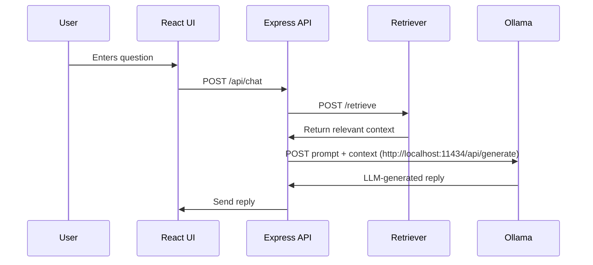

# LLM + RAG Chatbot (Modern Full Stack)

A full-stack chatbot application that uses React for the frontend and Node.js/Express for the backend, with a retriever service for Retrieval-Augmented Generation (RAG) using ChromaDB.

---

## Project Structure

```
llm-rag-chatbot-modern-full/
├── client/        # React frontend (Vite)
├── server/        # Express backend API
└── retriever/     # Retriever service (RAG, ChromaDB)
```

---

## Prerequisites

- Node.js (v18+ recommended)
- npm or yarn

---

## Setup Instructions

### 1. Clone the Repository

```sh
git clone <repo-url>
cd llm-rag-chatbot-modern-full
```

---

### 2. Install Dependencies

#### Frontend (client)

```sh
cd client
npm install
```

#### Backend API (server)

```sh
cd ../server
npm install
```

#### Retriever Service

```sh
cd ../retriever
npm install
```

---

### 3. Run the Services

#### Start Retriever Service

```sh
cd retriever
npm run start
```

#### Start Backend API

```sh
cd ../server
npm start
```

#### Start Frontend (React)

```sh
cd ../client
npm run dev
```

---

## Usage

1. Open your browser and go to [http://localhost:5173](http://localhost:5173) (or the port shown in your terminal).
2. Type a message in the chat





## 📌 Main Takeaways

### ✅ 1. Open Source LLMs Are Powerful and Accessible
- Models like **Gemma (Google)**, **LLaMa (Meta)**, **Qwen**, and **DeepSeek** are open and free to use.
- You get full access to **model weights**, allowing them to be run on local machines or private servers.

### 🚀 2. Performance Is Surprisingly Good
- Many small open models (e.g. **Gemma 27B**) perform well on benchmarks like **LM Arena Leaderboard**.
- Ideal for:
  - Data extraction
  - Document analysis
  - Content generation
  - Few-shot prompting

### 🔒 3. Benefits of Running Models Locally
- **100% privacy** – Data stays on your device.
- **Zero cost** – No need for OpenAI API keys or tokens.
- **Offline usage** – Perfect for flights or poor connectivity.
- **No latency** – Fast response directly from your machine.
- **No vendor lock-in** – Models stay consistent over time.

### 🛠️ 4. Tools to Use
#### LM Studio
- GUI-based and beginner-friendly.
- Cross-platform: Windows, macOS, Linux.
- Features:
  - Chat with models
  - Upload files/images
  - Download and manage models
  - Local API access

#### Ollama
- CLI-based with local API support.
- Can be run on rented servers and exposed over the network.

### 🔁 5. Real-World Use Cases
- Automate tasks like:
  - Code generation
  - Text summarization
  - Question-answering from private documents
- Integrate into your own apps using local APIs.

### 📘 6. Learn More with the Author's Course
Maximilian offers a comprehensive course covering:
- Installation and configuration
- Running and tweaking models
- Quantization for lower hardware usage
- Code integrations and practical examples

